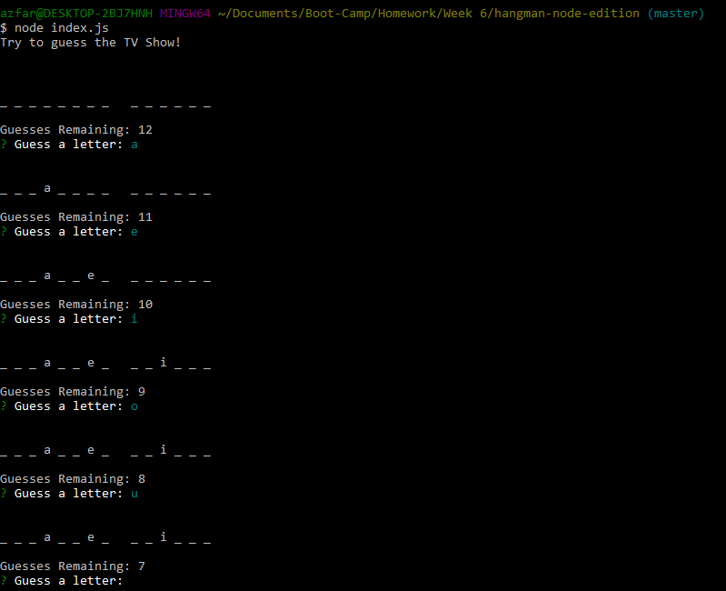

# Hangman: Node Edition
Hangman: Node Edition is a game of hangman built entirely as a backend application, which you can play in your terminal window through the use of Node. This application uses constructor functions hosted within their own javascript files, which are ultimately called upon by the main index javascript file.

# Images


# Prerequisites
- [node.js](https://nodejs.org/en/)
- [Git Bash](https://git-scm.com/downloads)

# Installation guide
- First you will need to download this folder to your computer. You may do this either by downloading the document as a zip file, or by cloning the git repository to a folder on your computer using Git Bash. In order to do this, click the green button labeled "Clone or Download", and select your method of retrieving the file.
- If you want to use the git clone method, your first step is to copy the link provided. From here you want to navigate to the desired location on your computer in your Git Bash terminal, or navigate to the desired location via your explorer, right click and select "Git Bash Here". Within your Git Bash terminal, type the following: 
`git clone https://github.com/aehaq/liri-node-app.git`
- Once the repository exists locally on your computer, navigate to within the newly downloaded folder using git bash, or use the "Git Bash Here" method to open the terminal within the correct folder.
- To ensure you are in the correct folder, type the following and hit enter: 
`ls`
- If succesful, all non-hidden documents and folders within your location should be listed. If this includes a file named 'liri.js', you are in the right place.
- Finally, you will need to ensure that all of the required npm packages are installed. Type the following phrase into your Git Bash terminal: 
`npm i`
- If succesful you should see a progress bar within the Git Bash terminal indicating installation progress. If this method does not work, try inputing the following command next.
`npm install inquirer`
- Once the instillations are complete, you are ready to run the app. 

# Use
To get Started with the application, you simply need to run the javascript file in your terminal using Node. You can do this by typing the following command when you have your GitBash terminal open and set to the right folder:
`node index.js`
Hit enter, and you should be good to go!

# Technology Used
- JavaScript
- Node.js
- NPM
- Inquirer.js

# Code Snippets
```
var Letter = require("./Letter.js");

var Word = function(arg) {
    this.answer = arg;
    this.characters = [];
    var letters = arg.split('');
    for (let i = 0; i < letters.length; i++) {
        this.characters.push(new Letter(letters[i]));
    }
    this.disp = function() {
        var string = '';
        for (let i = 0; i < this.characters.length; i++) {
            var chara = this.characters[i];
            string += chara.display();
        }
        string += "\n"
        return string
    }
    this.check = function(guess) {
        for (let i = 0; i < this.characters.length; i++) {
            var chara = this.characters[i];
            chara.verify(guess);
        }
    }
}

module.exports = Word;
```
This constructor function, though only a small portion of the total code, served as the backbone for this application. This function and the code linking it to other spreadsheets is the entirety of the Word.js javascript file, and is vital in pretty much all of the logic used throughout the game. The main things this function is responsible for are as follows:
- Storing the answer to the hangman game.
- Splitting the word into individual characters and retaining this list as an array.
- Storing each of those letters as individual objects by calling the Letter constructor.
- Taking a guessed character input and checking if it against the letters which exist within the object.
- Displaying the word in it's current gamestate based off of whether or not each object stored within it has already been guessed.

# Learning Points
- Learning how to use constructors to create objects with a variety of keys and methods.
- Cutting down on clutter by calling methods on objects created with imported constructors.
- Understanding how to use multiple constructors on multiple files to handle the creation of complex objects with complex functions.
- Using object functions to handle a large number of processes at once.
- Creating Recursive functions which call upon themselves until certain conditions are meant in order to create an ongoing use state.
- Implementing Inquirer.js to create an easy-to-use interactive application in terminal without the implementation of a front end.

# Author 
Azfar Haq - [GitHub](https://github.com/aehaq)

# License
Standard MIT License
